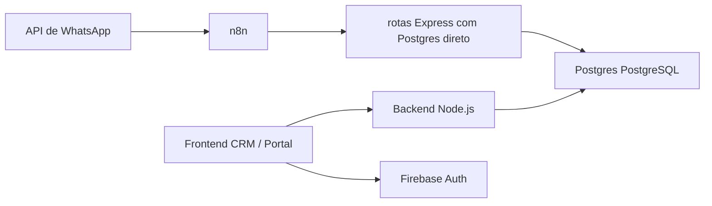

# VexoCrm
  
Monorepo do CRM e da operacao automatizada da Vexo/Infinie.
 
Hoje a arquitetura real do projeto e:

- `Postgres` como banco principal e camada de persistencia.
- `rotas Express com Postgres direto` como interface operacional do workflow.
- `n8n` como orquestrador do atendimento e da qualificacao.
- `frontend/` como CRM web para time interno e portal de clientes.
- `backend/` como API de apoio do CRM.
 
Nao existe mais fluxo operacional baseado em planilhas.

## Estado atual

As sete rotas Express ativas do projeto sao:
 
- `conversation-memory`
- `conversation-memory-latest`
- `lead-webhook`
- `n8n-planilha-webhook`
- `mark-lead-dispatched`
- `n8n-error-webhook`
- `notifications-api`

Funcoes antigas como `sheets-proxy` e `lead-exists-by-phone` foram removidas do conjunto operacional e nao devem mais ser documentadas como parte do runtime atual.

## Arquitetura resumida



## Estrutura do repositorio

```text
VexoCrm/
|-- backend/
|-- docs/
|-- frontend/
|   `-- Postgres/
|       `-- functions/
|-- scripts/
`-- database.md
```

## Diretorios principais

### `frontend/`

Aplicacao React/Vite usada pelo time operacional e pelo portal de clientes.

### `frontend/postgres/functions/`

Codigo-fonte das rotas Express que suportam o workflow do n8n e os pontos de integracao com o Postgres.

### `backend/`

API Node.js/Express usada pelo frontend.

### `docs/`

Documentacao tecnica, executiva e artefatos prontos para apresentacao.

## Fluxo operacional principal

1. O WhatsApp chega ao `n8n` via webhook.
2. O workflow identifica se a entrada e texto ou audio.
3. O fluxo consulta e persiste memoria usando `conversation-memory` e `conversation-memory-latest`.
4. O lead e criado e depois finalizado pela `lead-webhook`.
5. Erros operacionais sao registrados por `n8n-error-webhook`.
6. O CRM consulta o banco e notificacoes por meio do backend e da `notifications-api`.

## Documentacao principal

- [docs/README.md](docs/README.md)
- [docs/apresentacao-executiva.md](docs/apresentacao-executiva.md)
- [docs/arquitetura-operacional.md](docs/arquitetura-operacional.md)
- [docs/workflow-n8n.md](docs/workflow-n8n.md)
- [docs/postgres-functions.md](docs/postgres-functions.md)
- [database.md](database.md)
- [backend/README.md](backend/README.md)
- [frontend/README.md](frontend/README.md)

## Setup rapido

### Frontend

```powershell
cd frontend
npm install
npm run dev
```

### Backend

```powershell
cd backend
npm install
npm run dev
```

## Deploy com migrations

O auto deploy do backend no EasyPanel agora pode aplicar migrations automaticamente no startup do container.

Como o service do backend builda a imagem a partir de `backend/`, a copia usada no deploy automatico fica em `backend/postgres/migrations`.

Quando surgir migration nova em `frontend/postgres`, sincronize antes do commit:

```bash
node scripts/sync-postgres-assets.mjs
```

No EasyPanel, deixe configurado no service do backend:

- ou `DATABASE_URL`
- `RUN_POSTGRES_MIGRATIONS_ON_START=1`

## Observacao importante

Se voce for apresentar o projeto para cliente, parceiro ou time interno, use primeiro os arquivos em `docs/` e os PDFs gerados a partir deles. Os READMEs ficaram como referencia tecnica do repositorio.
