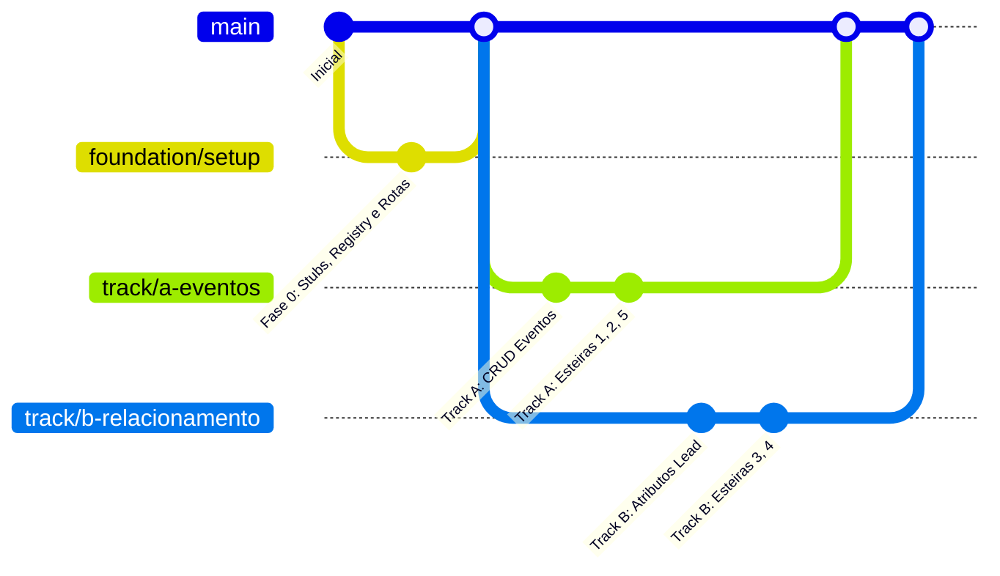

# Divisão de Demandas e Paralelização — LivPub × Vexo

Este documento descreve a divisão do trabalho para **2 desenvolvedores trabalharem em paralelo** no projeto VexoCRM para atender o escopo contratual da LivPub. 

A separação foi desenhada de forma a minimizar conflitos de merge e dependências cruzadas (lock-in) nas camadas de banco de dados (migrations), APIs de backend e telas do frontend.

---

## 📌 Estratégia de Branches e Git

Para garantir que os desenvolvedores trabalhem sem conflitos:

1. **`main`**: Branch de produção estável.
2. **`foundation/setup`**: Branch da **Fase 0 (Foundation)**. É a base comum.
3. **`track/a-eventos`** (Dev 1): Branch com foco na entidade Eventos e esteiras temporais.
4. **`track/b-relacionamento`** (Dev 2): Branch com foco nos atributos do Lead, segmentações e esteiras recorrentes.



---

## 🛠️ Fase 0: Foundation (1 Dev — 0.5 a 1 Dia)
*Esta fase deve ser desenvolvida por apenas um dos desenvolvedores e mergeada na `main` antes do início dos tracks paralelos.*

O objetivo é criar os pontos de extensão e stubs para que ambos os tracks funcionem de forma modular e independente, sem tocar nos mesmos arquivos centrais da aplicação.

### 1. Refatoração do Motor de Follow-up (`Registry Pattern`)
* **Onde:** `backend/src/followup/service.js` (ou arquivo equivalente do motor de réguas).
* **Ação:** Substituir a lógica rígida de `switch(tipo)` do cálculo de agendamentos (`calcScheduledFor`) por um mapa dinâmico de triggers registradas em runtime.
* **Implementação:**
  ```javascript
  const triggerHandlers = {};
  
  export function registerTriggerHandler(type, handlerFn) {
    triggerHandlers[type] = handlerFn;
  }
  
  // No motor de follow-up:
  export function calcScheduledFor(type, context) {
    const handler = triggerHandlers[type];
    if (!handler) {
      // Fallback para os comportamentos legados (on_schedule, before_meeting, etc.)
      return legacyCalc(type, context);
    }
    return handler(context);
  }
  ```

### 2. Interface Stub para Links de Pagamento
* **Onde:** `backend/src/payments/paymentLink.js` (Criar novo arquivo).
* **Ação:** Criar um stub unificado para que as esteiras possam gerar links de checkout fictícios para o cliente (ingresso, camarote, etc.), respeitando o multi-tenant.
* **Implementação:**
  ```javascript
  export function buildPaymentLink({ clientId, kind, ref }) {
    // Retorna uma URL stub parametrizada
    return `https://pay.livpub.com/stub/${clientId}?kind=${kind}&ref=${ref}`;
  }
  ```

### 3. Placeholders de Rotas e Navegação (Frontend)
* **Onde:** `frontend/src/App.tsx` e `frontend/src/components/AppSidebar.tsx` (ou componentes correspondentes).
* **Ação:** Adicionar as rotas `/crm/eventos` e `/crm/relacionamento` apontando para páginas vazias temporárias (stubs). Isso evita que os desenvolvedores editem os mesmos arquivos de rotas/sidebar posteriormente.

---

## 🚀 Track A (Dev 1) — Eventos e Esteiras Temporais (1, 2, 5)

Focado na entidade **Eventos e nas esteiras que dependem de uma data de evento específica.

### 📋 Demandas e Tarefas:

#### 1. [NEW] Banco de Dados: Tabela `events`
* **Arquivo:** `backend/migrations/*_create_events.sql`
* **Campos:** `id` (UUID), `client_id` (TEXT/FK para tenant), `name` (TEXT), `event_at` (TIMESTAMP), `created_at` (TIMESTAMP).
* **Regra Inviolável:** Toda query deve possuir índice e filtro obrigatório por `client_id` (multi-tenant).

#### 2. [NEW] Backend: Módulo de Eventos (`CRUD`)
* **Onde:** `backend/src/domains/events/` (Criar pasta isolada para manter rotas, controllers e services).
* **Endpoints:**
  * `GET /api/events` (Lista eventos do tenant atual).
  * `POST /api/events` (Cria evento para o tenant atual).
  * `DELETE /api/events/:id` (Remove evento).

#### 3. [NEW] Triggers e Esteiras Temporais
* **Arquivo:** `backend/src/followup/triggers/event.js` (Registrar no loader da Fase 0).
* **Esteira 1 — Pré-venda de Evento:**
  * Gatilho: `event_before_days` (ex: 3 dias antes do `event_at`).
  * Ação: Envia mensagem convidando para compra antecipada contendo o link retornado por `buildPaymentLink({ kind: "ingresso" })`.
* **Esteira 2 — Camarote / VIP:**
  * Gatilho: Direcionado para leads que pedem camarote.
  * Ação: IA de qualificação assume a conversa usando o prompt configurado para ticket alto e, se qualificado, envia `buildPaymentLink({ kind: "camarote" })`.
* **Esteira 5 — Pós-evento:**
  * Gatilho: `event_after_days` (ex: 1 dia após o `event_at`).
  * Ação: Mensagem de agradecimento + pesquisa de satisfação + cupom de retorno para o próximo evento.

#### 4. [MODIFY] Frontend: Tela de Eventos
* **Arquivo:** `frontend/src/pages/Eventos.tsx` (Substituir o stub).
* **UI:** Dashboard para gerenciar eventos (CRUD simples) e acompanhar estatísticas de envio das esteiras de evento (1, 2 e 5).

---

## 🚀 Track B (Dev 2) — Dados do Lead, Segmentação e Relacionamento (3, 4)

Focado no enriquecimento dos dados do lead, na configuração de segmentação dinâmica e esteiras recorrentes.

### 📋 Demandas e Tarefas:

#### 1. [NEW] Banco de Dados: Migração de Atributos de Lead
* **Arquivo:** `backend/migrations/*_add_lead_attributes.sql`
* **Campos:** Adicionar colunas `data_nascimento` (DATE), `ultima_visita` (DATE), e `perfil_musical` (TEXT) à tabela `leads`.
* **Regra:** Usar cláusulas `ALTER TABLE ... ADD COLUMN IF NOT EXISTS` para segurança e idempotência.

#### 2. [MODIFY] Configuração de Segmentação por Catálogo
* **Onde:** `backend/src/server.js` (ou arquivo de inicialização de tenant) / Catálogo de segmentação.
* **Ação:** Registrar o campo `perfil_musical` no catálogo de segmentação unificada (`segmentation_config.fields[]`) para o tenant da LivPub.
* **Resultado:** O motor de disparos existente passa a filtrar dinamicamente por `perfil_musical` através do JSON de filtros `{filters:[{field,operator,value}]}` herdado da unificação de segmentação. **Zero código novo de filtragem.**

#### 3. [NEW] Triggers de Relacionamento e Aniversário
* **Esteira 3 — Aniversariante:**
  * **Arquivo:** `backend/src/followup/triggers/birthday.js`
  * **Lógica:** Cron rodando uma vez por dia busca leads onde `EXTRACT(MONTH FROM data_nascimento) = EXTRACT(MONTH FROM NOW())` e `EXTRACT(DAY FROM data_nascimento) = EXTRACT(DAY FROM NOW())`.
  * **Fluxo:** Cria sugestão de envio de benefício no painel do assessor (seguindo o padrão do `automationEngine` de pré-aprovação).
* **Esteira 4 — Reativação de Clientes Inativos:**
  * **Arquivo:** `backend/src/followup/triggers/inactivity.js`
  * **Lógica:** Cron/worker periódico identifica leads cujo campo `ultima_visita < NOW() - X dias` e sugere mensagem de reativação com benefício de retorno.

#### 4. [MODIFY] Frontend: Tela de Relacionamento
* **Arquivo:** `frontend/src/pages/Relacionamento.tsx` (Substituir o stub).
* **UI:** Tela para listar aniversariantes do dia/mês, leads inativos sugeridos para reativação e gerenciamento do catálogo de segmentações específicas da empresa.

---

## 🛡️ Matriz de Impacto e Anti-Colisão

| Arquivo | Fase 0 | Track A (Dev 1) | Track B (Dev 2) | Risco de Conflito |
| :--- | :---: | :---: | :---: | :---: |
| `backend/src/followup/service.js` | ✏️ Edita | 🟢 Consome | 🟢 Consome | Baixo (editado só na Fase 0) |
| `backend/src/payments/paymentLink.js` | ✏️ Cria | 🟢 Consome | 🟢 Consome | Nulo |
| `frontend/src/App.tsx` | ✏️ Edita | — | — | Baixo (editado só na Fase 0) |
| `frontend/src/components/AppSidebar.tsx` | ✏️ Edita | — | — | Baixo (editado só na Fase 0) |
| `backend/migrations/*.sql` | — | ✏️ Cria nova | ✏️ Cria nova | Nulo (timestamps diferentes) |
| `backend/src/domains/events/*` | — | ✏️ Cria novos | — | Nulo (exclusivo do Track A) |
| `backend/src/followup/triggers/event.js` | — | ✏️ Cria | — | Nulo (exclusivo do Track A) |
| `backend/src/followup/triggers/birthday.js`| — | — | ✏️ Cria | Nulo (exclusivo do Track B) |
| `backend/src/followup/triggers/inactivity.js`| — | — | ✏️ Cria | Nulo (exclusivo do Track B) |
| `frontend/src/pages/Eventos.tsx` | ✏️ Stub | ✏️ Completa | — | Nulo (exclusivo do Track A) |
| `frontend/src/pages/Relacionamento.tsx` | ✏️ Stub | — | ✏️ Completa | Nulo (exclusivo do Track B) |

---

## 📌 Regras de Ouro de Desenvolvimento (Baseado no CLAUDE.md)

1. **Multi-Tenant Rigoroso:** Toda query SQL, rota ou inserção de dados deve possuir a cláusula de `client_id` (ou `tenantId` correspondente) para isolamento absoluto de dados.
2. **Apenas Postgres:** Não há infraestrutura do Supabase de verdade ativa (apenas nomenclatura herdada no código). Escreva código SQL nativo para o PostgreSQL via a conexão existente do backend.
3. **Evidência Real de Testes:** Cada dev, ao finalizar um módulo, deve anexar no card/PR os logs de execução, saída de queries de migração aplicadas, ou resposta de requisições curl de teste (critérios de aceite objetivos).
