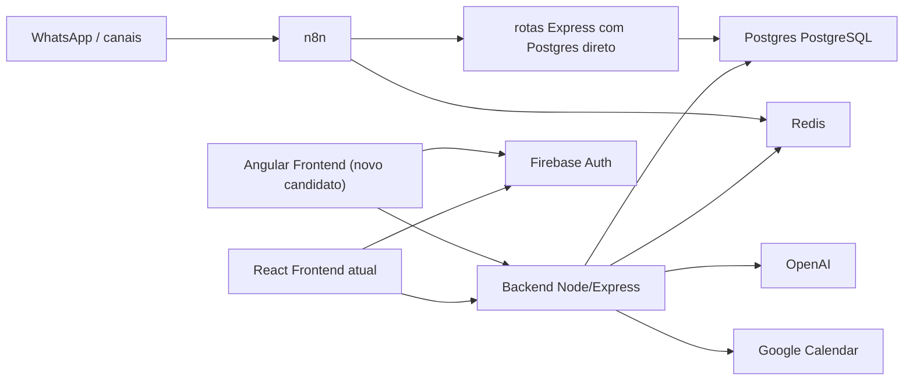

# SDD - Vexo CRM Multiagent Platform

## Status do documento

- Versao: `0.1-draft`
- Data: `2026-05-05`
- Autor: Codex
- Status: `Draft com pendencias criticas`

## ADR-001 - Estrategia de adocao do Angular

### Titulo

Angular sera iniciado como sidecar incremental, nao como substituicao imediata do React.

### Status

`Aprovada`

### Contexto

O repositorio atual possui um frontend operacional em `React + Vite`, integrado ao backend Node/Express, Firebase Auth, Postgres, rotas Express e n8n.

O CRM ja esta em operacao e nao pode sofrer uma reescrita abrupta com risco de regressao funcional.

Ao mesmo tempo, existe a diretriz de iniciar uma nova frente em Angular, com arquitetura mais modular e rollout controlado.

### Decisao

O Angular sera adotado como **app novo em paralelo**, em formato **sidecar incremental**.

Isso significa:

1. O frontend React/Vite atual permanece ativo e sem substituicao imediata
2. O Angular sera criado como novo frontend/modulo separado
3. O rollout inicial sera restrito a dominios menos criticos e mais controlados
4. O backend, auth, Postgres, rotas Express e integracoes atuais serao reaproveitados
5. Nenhuma area critica do CRM sera migrada antes de validacao de estabilidade

### Escopo inicial aprovado para Angular

1. `Vexo Labs`
2. `Dashboard`
3. `Requests`

### Consequencias positivas

- reduz risco operacional
- preserva o CRM atual
- permite validar Angular com contratos reais
- evita retrabalho de backend e integracoes
- cria uma trilha segura de avaliacao antes de qualquer migracao maior

### Riscos e cuidados

- coexistencia temporaria de dois frontends
- necessidade de manter contratos de API estaveis
- risco de divergencia visual e funcional entre React e Angular
- necessidade de validar tenant selecionado, auth, permissoes e performance em ambos os frontends

### Mitigacoes

1. Reaproveitar backend e contratos existentes
2. Limitar o Angular a modulos de baixo risco no inicio
3. Fazer rollout por feature e por ambiente
4. Validar auth, tenant, permissoes e performance antes de expandir escopo

### Criterio para expandir Angular

Outras areas do CRM so poderao migrar para Angular depois de:

1. estabilidade funcional comprovada
2. contratos de API validados
3. auth e tenant testados
4. performance aceitavel em uso real
5. aprovacao explicita da Vexo

## Objetivo do documento

Este documento descreve o desenho de software da evolucao do CRM da Vexo para suportar operacao multiagente, mantendo o ecossistema atual e reduzindo retrabalho.

O documento foi elaborado com base em:

1. Estrutura real do repositorio atual
2. Documentacao tecnica local do projeto
3. Contexto recuperado do Segundo Cerebro via MCP + RAG

## Fonte das decisoes

### Reaproveitado do Obsidian

- O foco do projeto esta em operacao de CRM, qualificacao, funil, mensagens e refinamento continuo da maquina comercial
- O funil precisa ter etapas claras, campos padronizados e alertas para leads que esfriam
- A recomendacao recorrente e documentar exatamente quando o lead muda de etapa, quem age e qual mensagem sai em cada momento

### Reaproveitado do projeto atual

- Arquitetura operacional centrada em `n8n + Postgres + rotas Express`
- Frontend atual em `React + Vite`
- Backend atual em `Node.js + Express`
- Autenticacao atual via `Firebase Auth`
- Persistencia principal via `Postgres PostgreSQL`

### Novo padrao candidato

- Uso de `Angular` como stack de frontend para evolucao futura

Observacao importante:

O uso de Angular nao aparece como padrao consolidado no Obsidian atual nem como stack existente no repositorio atual. Portanto, Angular e tratado como decisao arquitetural nova, ja aprovada apenas no formato definido pela `ADR-001`: **sidecar incremental em paralelo ao React**.

---

## 1. Diagnostico inicial

## 1.1 Estado atual do repositorio

O projeto atual nao e Angular.

O repositorio inspecionado tem a seguinte forma:

```text
New project/
|-- backend/
|-- docs/
|-- frontend/
|-- scripts/
|-- database.md
`-- README.md
```

### Frontend atual

- Stack: `React 18 + TypeScript + Vite`
- Estado: app operacional existente
- Bibliotecas principais:
  - `@tanstack/react-query`
  - `firebase`
  - `recharts`
  - `radix-ui`
  - `zod`

### Backend atual

- Stack: `Node.js + Express`
- Integracoes:
  - `Postgres`
  - `Firebase Admin`
  - `whatsapp-web.js`

### Arquitetura operacional atual

Segundo `README.md` e `docs/arquitetura-operacional.md`, o eixo real do produto hoje e:

- entrada via WhatsApp
- orquestracao via `n8n`
- persistencia via `Postgres`
- rotas Express para pontos operacionais
- frontend React/Vite como CRM
- backend Node/Express como API de apoio

## 1.2 Tensao arquitetural identificada

Existe uma tensao clara entre:

1. **realidade atual do projeto**: React/Vite operacional
2. **pedido novo**: implementar com Angular

Migrar imediatamente para Angular sem recorte definido teria alto risco porque:

- reabre toda a camada de UI
- exige redefinicao de componentes, roteamento, auth e integracao
- cria retrabalho sobre uma base que ja existe
- conflita com a estrategia recente de preservar o CRM existente

## 1.3 Conclusao do diagnostico

A melhor leitura tecnica neste momento e:

- **nao substituir a base atual de imediato**
- **tratar Angular como uma frente nova, planejada e isolada**
- **usar o SDD para decidir se Angular entra como sidecar, novo app ou futura migracao**

---

## 2. Insights do Obsidian via RAG

## 2.1 O que foi encontrado

Buscas executadas:

- `angular architecture`
- `component patterns`
- `service patterns`
- `error handling angular`
- `form validation strategy`
- `project structure`
- `best practices`
- `previous SDD`
- `React Vite CRM architecture patterns Postgres firebase n8n redis whatsapp previous design decision`

## 2.2 Resultado real do RAG

O indice atual do Segundo Cerebro retornou principalmente:

- `dashboard-inifie.md`
- `dashboard-outlier.md`
- `_memory/current-state.md`
- `_knowledge/projects.md`
- `_knowledge/goals.md`
- `_knowledge/references.md`
- `neural-hub.md`

## 2.3 Aprendizados reutilizaveis

Dos resultados, os principios reaproveitaveis mais fortes foram:

1. O CRM precisa servir a operacao comercial e nao apenas exibir dados
2. O funil deve ter etapas claras e mudancas de estado bem documentadas
3. Campos principais precisam ser padronizados
4. Deve haver separacao visivel entre leads quentes, mornos e frios
5. A maquina de follow-up e alertas de esfriamento e central para o valor do sistema
6. O proximo passo recomendado e sempre documentar:
   - quando o lead muda de etapa
   - quem age
   - qual mensagem sai

## 2.4 O que nao foi encontrado

Nao apareceu no indice atual:

- SDD anterior completo
- padrao Angular consolidado
- convencao clara de modulos Angular
- estrategia registrada de migracao React -> Angular

## 2.5 Impacto disso no desenho

Por isso, no SDD:

- o desenho funcional vai reaproveitar o dominio e os fluxos do CRM atual
- a camada Angular sera proposta como **novo padrao candidato**
- decisoes de implementacao Angular ficam marcadas com pendencias de aprovacao

---

## 3. Goal

Projetar uma evolucao do CRM da Vexo para uma plataforma multiagente robusta, rastreavel e preparada para escalar operacao comercial, preservando o backend operacional existente e avaliando Angular como nova stack de frontend de forma controlada.

### Metas centrais

1. Centralizar operacao comercial multiagente
2. Manter integracao com Postgres, Redis, n8n, WhatsApp e Google Calendar
3. Tornar funil, follow-up, handoff e solicitacoes totalmente rastreaveis
4. Reduzir perda de contexto entre agentes e humano
5. Estruturar frontend futuro de forma modular

---

## 4. Scope

## 4.1 Dentro do escopo

- Documentar a arquitetura alvo
- Planejar a evolucao funcional do CRM multiagente
- Definir estrutura de frontend alvo em Angular
- Definir contratos de integracao com backend existente
- Definir modulo de autenticacao, funil, agentes, solicitacoes, produtos, relatorios e Vexo Labs
- Definir estrategia GSD de execucao

## 4.2 Fora do escopo imediato

- Reescrever todo o backend existente
- Trocar Postgres
- Trocar Firebase Auth sem motivo forte
- Substituir n8n
- Migrar todo o frontend de uma vez

## 4.3 Escopo aprovado para Angular

Conforme `ADR-001`, Angular entra apenas como **sidecar incremental**.

### Forma de adocao aprovada

- app novo, separado e isolado
- sem substituir o React atual
- sem alterar rotas, build ou deploy do frontend atual
- com rollout inicial apenas em modulos de risco controlado

### Escopo funcional inicial aprovado

1. `Vexo Labs`
2. `Dashboard`
3. `Requests`

### Fora do escopo desta fase

- migrar `Leads`
- migrar `WhatsApp`
- migrar portal do cliente
- remover ou refatorar o frontend React atual
- alterar backend, Postgres, rotas Express, n8n ou auth sem necessidade documentada

---

## 5. Design

## 5.1 Arquitetura alvo



### Leitura arquitetural obrigatoria

- `React/Vite` continua sendo o frontend operacional principal
- `Angular` nasce como sidecar paralelo
- ambos consomem o mesmo backend e o mesmo ecossistema operacional
- nenhum componente critico do runtime atual sera movido nesta fase

## 5.2 Principios de desenho

### Reaproveitado do projeto atual

- backend continua sendo gateway de produto
- fluxo operacional segue em `n8n + Postgres + rotas Express`
- auth segue em Firebase

### Reaproveitado do Obsidian

- foco em operacao, nao em tela decorativa
- funil com etapas explicitas
- campos padronizados
- alertas para lead esfriando

### Novo padrao candidato

- frontend modular em Angular

## 5.3 Estrutura Angular recomendada

```text
New project/
|-- backend/
|-- docs/
|-- frontend/                # React/Vite atual, preservado
|-- apps/
|   `-- angular-crm/         # sidecar Angular isolado
|       |-- angular.json
|       |-- package.json
|       `-- src/
|           `-- app/
|               |-- core/
|               |   |-- auth/
|               |   |-- http/
|               |   |-- guards/
|               |   |-- interceptors/
|               |   `-- services/
|               |-- shared/
|               |   |-- components/
|               |   |-- directives/
|               |   |-- pipes/
|               |   `-- utils/
|               |-- features/
|               |   |-- dashboard/
|               |   |-- requests/
|               |   `-- vexo-labs/
|               `-- layout/
```

### Regra de isolamento

- o sidecar Angular nao deve editar arquivos do `frontend/` React
- o sidecar Angular possui `package.json`, `angular.json` e build proprios
- dependencias Angular ficam confinadas em `apps/angular-crm`
- variaveis de ambiente do sidecar devem ser documentadas separadamente

### Validacao estrutural desta fase

Durante o scaffold inicial:

- nao foi encontrado conflito estrutural de monorepo
- nao foi necessario alterar `backend/`
- nao foi necessario alterar `frontend/`
- nao foi necessario alterar variaveis de ambiente atuais
- a porta padrao do Angular sidecar (`4200`) nao conflita com a porta usada localmente pelo React atual (`8080`)

## 5.4 Convencoes Angular propostas

Como nao ha padrao Angular no Obsidian, estas convencoes ficam como **Novo padrao candidato**:

1. `core/` para servicos singleton e infraestrutura
2. `shared/` para UI e utilitarios reutilizaveis
3. `features/` por dominio de negocio
4. `smart components` por rota
5. `presentational components` dentro de cada feature
6. `facades` opcionais para reduzir acoplamento de componentes com HTTP
7. `Reactive Forms` como padrao de formularios
8. `Signals` ou `RxJS` conforme necessidade, com preferencia por simplicidade

## 5.5 Dominios funcionais

### Dashboard

Responsabilidades:

- KPIs operacionais
- funil de leads
- fila humana
- followups
- visao de solicitacoes e cobranca

### Requests

Responsabilidades:

- controle de solicitacoes
- escopo
- cobranca
- entrega
- historico

### Products

Responsabilidades:

- catalogo de planos
- plano contratado por cliente
- oportunidades de upgrade

### Reports

Responsabilidades:

- performance comercial
- gargalos operacionais
- exportacao de dados

### Vexo Labs

Responsabilidades:

- criar agentes internos
- testar agentes
- observar logs
- preparar liberacao futura

## 5.6 Estrategia de integracao

O frontend Angular deve consumir o backend atual por contratos HTTP claros.

### Restricao de integracao nesta fase

- o Angular sidecar deve apenas consumir contratos existentes ou contratos novos explicitamente documentados
- qualquer mudanca necessaria de backend deve ser registrada antes de implementacao
- nenhum ajuste em rotas Express, n8n ou auth deve ocorrer como efeito colateral do scaffold

### Endpoints a manter/reaproveitar

- `GET /api/lead-clients`
- `GET /api/dashboard`
- `GET /api/leads`
- `GET /api/notifications`
- `PATCH /api/notifications`

### Endpoints novos ou consolidados esperados

- `GET /api/crm/overview`
- `GET /api/crm/leads`
- `GET /api/crm/leads/:id`
- `GET /api/crm/agents`
- `GET /api/crm/reports`
- `GET /api/client-plans`
- `GET /api/client-requests`
- `GET /api/request-control/catalog`

## 5.7 Estrategia de estado

### Recomendacao

- dados remotos: `Angular HttpClient + query facade pattern`
- estado de tela: local ao componente
- filtros: sincronizados com URL
- formularios: `Reactive Forms`

### Justificativa

O projeto atual ja usa URL e hooks de consulta por tela. Em Angular, o equivalente mais estavel e:

- query params para filtro
- servicos por dominio
- resolucao de dados por rota quando fizer sentido

## 5.8 Validacao e tratamento de erro

### Recomendacao

- validacao de formulario com `Reactive Forms`
- validacao de contrato no backend permanece com `zod`
- erros HTTP tratados por interceptor global
- toasts padronizados por camada shared

### Novo padrao candidato

Criar `Error Handling Strategy Angular` com:

- interceptor para mapear erros
- componentes de empty/error state
- logging estruturado por feature

## 5.9 Autenticacao e autorizacao

### Reaproveitado do projeto atual

- Firebase Auth mantido
- backend continua validando token

### Frontend Angular

- `AuthService`
- `AuthGuard`
- `RoleGuard`
- `FeatureFlagGuard`

### Permissoes importantes

- interno
- cliente
- vexo admin
- feature flags como `vexo_agents_enabled`

## 5.10 Observabilidade

- healthcheck backend
- logs de agente
- logs de n8n
- logs de erro de OpenAI
- logs de Redis e Postgres

## 5.11 Testes

### Frontend Angular

- build isolado do sidecar
- testes de componentes criticos
- testes de formularios
- testes de guards
- testes de servicos HTTP

### Integracao

- contratos com backend
- roteamento protegido
- filtros e query params

### E2E

- login
- abrir dashboard
- navegar no funil
- abrir lead
- registrar solicitacao
- testar agente

---

## 6. Do

## Fase 1 - Preparacao

1. Registrar e aprovar `ADR-001`
2. Criar SDD final alinhado com sidecar incremental
3. Congelar contratos do backend a serem consumidos
4. Validar estrutura de repositorio para coexistencia de dois frontends

## Fase 2 - Bootstrap Angular

1. Criar app Angular em `apps/angular-crm`
2. Definir `core`, `shared`, `features`
3. Validar build isolado
4. Criar README curto do sidecar
5. Nao tocar no frontend React atual

## Fase 3 - Modulos centrais

1. Dashboard
2. Requests
3. Vexo Labs

## Fase 4 - Integracao

1. Integrar backend atual
2. Integrar Firebase
3. Integrar feature flags
4. Validar query params e filtros
5. Validar tenant/empresa selecionada

## Fase 5 - QA

1. Testes unitarios
2. Testes de integracao
3. Smoke test com dados reais
4. Comparacao de comportamento Angular vs React nas areas sidecar

---

## 7. Debug

## Riscos principais

1. Duplicacao temporaria de UI entre React e Angular
2. Divergencia entre contratos atuais e frontend sidecar
3. Inconsistencia de auth ou tenant entre os dois frontends
4. Conflito de porta, build ou dependencia no repositorio
5. Crescimento de complexidade operacional

## Mitigacoes

1. Adotar Angular apenas no formato sidecar incremental aprovado
2. Preservar backend e contratos
3. Isolar Angular em `apps/angular-crm`
4. Fazer rollout por modulo
5. Validar cada feature com dados reais antes de expandir
6. Documentar qualquer conflito estrutural antes de corrigi-lo

---

## 8. Deliver

Entregaveis esperados:

1. `docs/SDD.md`
2. plano GSD aprovado
3. decisoes arquiteturais registradas
4. scaffold Angular sidecar isolado
5. README curto de execucao do sidecar
6. build inicial validado

---

## 9. Plano GSD detalhado

## Goal

Definir e executar a evolucao do CRM da Vexo para suportar operacao multiagente com uma estrategia segura para Angular.

## Scope

- manter backend atual
- manter auth atual
- manter eixo operacional atual
- adotar Angular como sidecar incremental controlado

## Design

- frontend Angular modular e isolado em `apps/angular-crm`
- backend atual reaproveitado
- feature flags
- contratos HTTP claros

## Do

### Sprint 0

- aprovar estrategia sidecar Angular
- aprovar estrutura do app
- mapear endpoints reais

### Sprint 1

- bootstrap Angular
- shell inicial
- layout
- dashboard

### Sprint 2

- requests
- routing
- guards basicos

### Sprint 3

- Vexo Labs
- auth
- tenant context

### Sprint 4

- validacao integrada
- testes
- criterio de expansao

## Debug

- validar auth
- validar tenant selecionado
- validar estados vazios
- validar erros de API
- validar filtros por URL
- validar build isolado sem tocar no React

## Deliver

- shell Angular navegavel
- Dashboard, Requests e Vexo Labs planejados para rollout
- contratos testados
- docs atualizadas

---

## 9.1 Estrategia de rollout

### Etapa 0 - Scaffold

- criar Angular sidecar isolado
- validar build
- nao integrar funcionalmente com areas criticas

### Etapa 1 - Integracao controlada

- conectar auth
- conectar tenant selecionado
- validar chamadas ao backend

### Etapa 2 - Modulos de baixo risco

- Dashboard
- Requests
- Vexo Labs

### Etapa 3 - Validacao operacional

- comparar comportamento com frontend React
- medir estabilidade
- colher feedback interno

### Etapa 4 - Decisao de expansao

So apos sucesso nas etapas anteriores:

- avaliar Products
- avaliar Reports
- decidir se outras areas entram

---

## 9.2 Criterios de validacao antes de expandir Angular

Angular so pode expandir para novos dominios se todos os itens abaixo forem verdadeiros:

1. build do sidecar e estavel
2. auth funciona sem regressao
3. tenant selecionado e respeitado corretamente
4. contratos de API consumidos estao estaveis
5. performance inicial e aceitavel
6. nao ha impacto no frontend React atual
7. feedback interno da Vexo aprova a experiencia

---

## 10. Sugestoes de reutilizacao do Obsidian

Mesmo sem um padrao Angular maduro, o Obsidian ja ajuda muito nestes pontos:

1. Regras do funil
2. Criterios de qualificacao
3. Regras de follow-up
4. Estrategia de alertas para leads frios
5. Definicao de papeis dos agentes
6. Priorizacao operacional do CRM

### Sugestao pratica

Criar no Obsidian estas notas novas:

- `architecture/angular-crm-decision.md`
- `patterns/angular/project-structure.md`
- `patterns/angular/forms-and-validation.md`
- `patterns/angular/error-handling.md`
- `sdd/vexo-crm-angular-sdd.md`

---

## 11. Aprendizado registrado

## Aprendizado

O repositorio atual tem arquitetura operacional madura em React/Vite + Node + Postgres + n8n, mas ainda nao possui base consolidada para Angular.

## Contexto

Foi solicitado SDD com implementacao Angular e uso obrigatorio do Segundo Cerebro.

## Decisao

Tratar Angular como novo padrao candidato no formato sidecar incremental aprovado pela `ADR-001`.

## Justificativa

Nao ha evidencia no codigo atual nem no Obsidian de que Angular seja padrao estabelecido para este produto.

## Impacto futuro

Reduz risco de reescrita precipitada e permite evolucao controlada.

---

## 12. Pendencias

1. Confirmar se o SDD deve mirar:
   - o CRM inteiro
   - apenas o modulo multiagente
   - apenas o Vexo Labs
2. Confirmar se ha um template de SDD fora do indice atual do Obsidian
3. Confirmar se o Segundo Cerebro tera escrita habilitada para registrar aprendizados de forma automatica

---

## 13. Recomendacao final

Recomendacao tecnica atual:

- **nao reescrever o CRM existente agora**
- **manter Angular apenas como sidecar incremental nesta fase**
- **preservar backend e operacao atual**
- **comecar por um app Angular paralelo e por um dominio limitado**

Dominio inicial recomendado para Angular:

1. `Vexo Labs`
2. `Dashboard`
3. `Requests`

Isso reduz risco e cria aprendizado real antes de tocar o resto do CRM.
